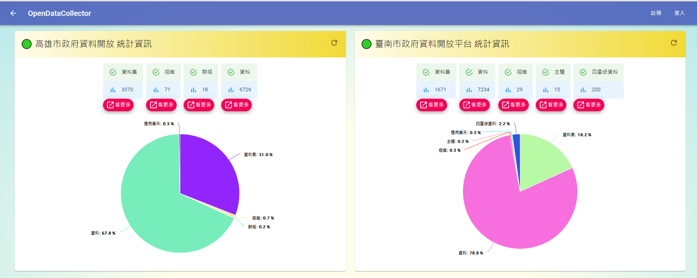
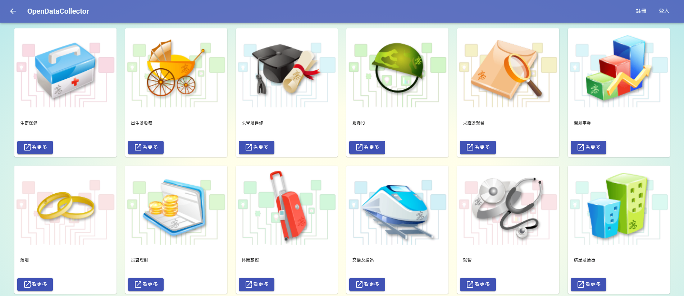

# 系統啟動方式
1. docker-compose
   - 如果是第一次啟動系統，則需執行以下指令，以建立identity-service需要用到的資料庫
      ``` bash
      cd api-service/identity-service
      dotnet restore
      dotnet ef database update --context PersistedGrantDbContext
      dotnet ef database update --context ConfigurationDbContext
      ```
   - 在終端機界面執行以下指令
      ``` bash
      docker compose up -d --build
      ```      
   - 開啟 http://localhost:3333
2. kubernetes
   - [參考此文件](./minikube#readme)
# 系統功能
- 建立排程下載政府OpenData
- 使用[dapr](https://dapr.io/)建立的雲原生系統
# 系統說明
| 服務名稱                   | 類型              | 用途                                                              |
| -------------------------- | :---------------- | :---------------------------------------------------------------- |
| nodeapp                    | 網站              | OpenDataCollector網站                                             |
| nodeapp-dapr               | dapr side-car服務 | 處理nodeapp與dapr的溝通                                           |
| kao-service                | Api               | 高雄市OpenData Api                                                |
| kao-service-dapr           | dapr side-car服務 | 處理kao-service與dapr的溝通                                       |
| tainan-service             | Api               | 台南市OpenData Api                                                |
| tainan-service-dapr        | dapr side-car服務 | 處理tainan-service與dapr的溝通                                    |
| pthg-service               | Api               | 屏東縣OpenData Api                                                |
| pthg-service-dapr          | dapr side-car服務 | 處理pthg-service與dapr的溝通                                      |
| taichung-service           | Api               | 台中市OpenData Api                                                |
| taichung-service-dapr      | dapr side-car服務 | 處理taichung-service與dapr的溝通                                  |
| account-service            | Api               | 帳號相關Api                                                       |
| account-service-dapr       | dapr side-car服務 | 處理account-service與dapr的溝通                                   |
| task-service               | Api               | 排程管理相關Api                                                   |
| task-service-dapr          | dapr side-car服務 | 處理task-service與dapr的溝通                                      |
| file-download-service      | Api和背景排程服務 | 執行下載檔案排程任務                                              |
| file-download-service-dapr | dapr side-car服務 | 處理file-download-service與dapr的溝通                             |
| subscribe-service          | pub/sub服務       | 接收publishers所發送的任務                                        |
| subscribe-service-dapr     | dapr side-car服務 | 處理subscribe-service與dapr的溝通                                 |
| api-gateway-service        | Api               | Envoy Api Gateway，統一Api的連線網址                              |
| api-gateway-service-dapr   | dapr side-car服務 | 處理api-gateway-service與dapr的溝通                               |
| identity-service           | Api               | IdentityServer4 服務                                              |
| identity-service-dapr      | dapr side-car服務 | 處理identity-service與dapr的溝通                                  |
| placement                  | dapr服務          | dapr放置服務，產生HashTable儲存dapr side-car服務的連線名稱        |
| redis                      | redis資料庫       | 提供dpar狀態管理和執行pub/sub功能                                 |
| mongo                      | mongodb資料庫     | 儲存與OpenDataCollector網站相關的資料，例如：使用者帳號資料和排程 |
| mongo-express              | 網站              | mongodb的網站式管理平台                                           |
| identity-server-db         | sql server資料庫  | IdentityServer4的資料庫                                           |
# 系統架構圖

<center>
</center>

# 系統畫面
- 各縣市Open Data統計資料
<center>
</center>

- 組織資料
<center>
</center>

- 群組資料
<center>
</center>

- Open Data列表
<center>
</center>

- Open Data明細
<center>
</center>

- 排程管理
<center>
</center>

# 其他指令
```bash
net stop winnat
net start winnat
curl  POST 'http://localhost:5000/connect/token' --header 'Content-Type: application/x-www-form-urlencoded' --data-urlencode 'client_id=client' --data-urlencode 'client_secret=secret' --data-urlencode 'scope=api1' --data-urlencode 'grant_type=client_credentials'

dotnet ef migrations add InitialIdentityServerPersistedGrantDbMigration -c PersistedGrantDbContext -o Data/Migrations/IdentityServer/PersistedGrantDb

dotnet ef migrations add InitialIdentityServerConfigurationDbMigration -c ConfigurationDbContext -o Data/Migrations/IdentityServer/ConfigurationDb

cd api-service/identity-service
dotnet ef database update --context PersistedGrantDbContext
dotnet ef database update --context ConfigurationDbContext
http://localhost:3000

{
   userId:1,
scheduleId:2,
dataCount: {$size: "$data"}
}
```
# Refrence
- simple custom hook
  - https://usehooks.com/

